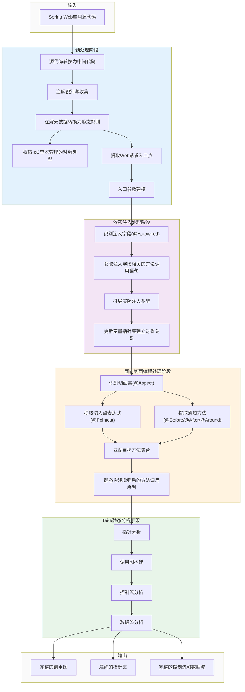

# 图3-1 基于静态规则与应用程序上下文的Spring Web应用静态分析方法整体架构

## 图3-1说明

本架构图展示了Spring Web应用静态分析方法的三阶段处理流程：

### 预处理阶段
- **目标**：解决Web应用多入口点问题
- **主要任务**：
    - 将源代码转换为中间代码表示
    - 识别并收集Spring相关注解（@Controller、@Service、@RequestMapping等）
    - 将注解元数据转换为静态分析规则
    - 提取IoC容器管理的所有Bean类型
    - 提取所有Web请求入口点并进行参数建模

### 依赖注入处理阶段
- **目标**：解决依赖注入导致的对象关系不明确问题
- **主要任务**：
    - 识别带有@Autowired等注解的注入字段
    - 获取所有与注入字段相关的方法调用语句
    - 根据字段声明类型推导实际注入的具体实现类型
    - 将推导出的实际类型对象映射到变量指针集中

### 面向切面编程处理阶段
- **目标**：解决AOP动态代理导致的方法调用缺失问题
- **主要任务**：
    - 识别系统中的切面类（@Aspect）
    - 提取切入点表达式（@Pointcut）和通知方法（@Before、@After、@Around等）
    - 根据切入点表达式匹配受影响的目标方法集合
    - 静态构建包含通知方法的完整调用序列，模拟代理对象行为

### Tai-e静态分析框架
基于前三阶段的处理结果，执行核心静态分析：
- 指针分析
- 调用图构建
- 控制流分析
- 数据流分析

### 输出结果
生成准确完整的分析结果：
- 完整的调用图
- 准确的指针集
- 完整的控制流和数据流信息